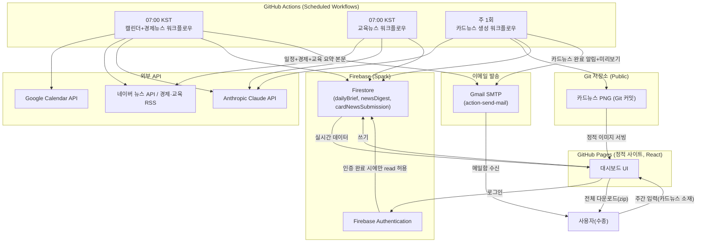

# 개인 업무 자동화 어시스턴트 — PRD (Product Requirements Document)

- 작성일: 2026-07-17
- 작성자: 수종 (기획) / Claude (문서화 지원)
- 문서 상태: Draft v1.0
- 리포지토리 형태(제안): **Public repo** + **GitHub Pages** + **Firebase** (근거는 4장 참고)

---

## 1. 개요 및 목표

매일 아침 업무를 시작하기 전에 확인해야 할 정보(일정 · 경제 뉴스 · 교육 뉴스)를 자동으로 수집·요약하여 하나의 대시보드에서 확인하고, 주 1회는 신앙 콘텐츠(카드뉴스)를 자동 제작하는 개인용 자동화 시스템을 구축한다.

| 목표 | 설명 |
|---|---|
| 정보 습득 자동화 | 매일 아침 7시 이전에 "오늘 일정 + 밤사이 경제 뉴스"가 정리되어 있어야 함 |
| 리서치 자동화 | 교육 정책/이슈 뉴스를 놓치지 않고 큐레이션 |
| 콘텐츠 제작 자동화 | 주 1회 카드뉴스(8장) 초안을 자동 생성, 사람은 다운로드 후 수동 게시만 담당 |
| 알림 자동화 | 매일 아침 브리핑과 주간 카드뉴스 준비 완료를 이메일로 수신 |
| 운영 비용 최소화 | GitHub(무료) + Firebase Spark(무료 티어) 안에서 운영 가능하도록 설계 |
| 유지보수 용이성 | 코드/설정은 전부 Git으로 관리, Claude Code로 반복 개발 가능한 구조 |

---

## 2. 기술 스택

| 영역 | 선택 | 비고 |
|---|---|---|
| 프론트엔드 | React 19 + TypeScript + Vite | AV System Builder와 동일한 스택 재사용 가능 |
| 호스팅 | GitHub Pages | 정적 사이트만 배포, 개인정보는 여기에 굽지 않음(4.3절 참고) |
| 자동화/배치 | GitHub Actions (scheduled workflow) | 크론 기반, 저장소가 public이면 무제한 무료 |
| 데이터베이스 | Firebase Firestore (Spark 무료 플랜) | 인증 사용자만 read 가능하도록 보안 규칙 필수 |
| 인증 | Firebase Authentication (Google 로그인) | 대시보드 접근 제어용 |
| 일정 연동 | Google Calendar API | OAuth2, refresh token은 GitHub Secrets에 저장 |
| 뉴스 수집 | 네이버 뉴스 검색 API + RSS(연합인포맥스, 한국은행, 교육부 등) | 무료, 앱당 일 25,000회 쿼터 |
| 요약/생성 AI | Anthropic Claude API | 뉴스 요약, 카드뉴스 콘텐츠(JSON) 생성 |
| 카드뉴스 이미지 렌더링 | Playwright(headless Chromium) + HTML/CSS 템플릿 | GitHub Actions에서 슬라이드별 PNG 캡처 |
| 이메일 알림 | Gmail SMTP(App Password) + `dawidd6/action-send-mail` | 매일 아침 브리핑 결과를 사용자 이메일로 발송, 무료 개인 Gmail 기준 일 500통 한도 |

> **참고(2026년 기준 확인된 수치)**: GitHub Actions는 public 저장소일 경우 실행 시간 무제한 무료이며, private 저장소는 Free 플랜 기준 월 2,000분까지 무료입니다. 크론은 2026년 3월부터 `timezone` 필드로 IANA 타임존(`Asia/Seoul`)을 직접 지정할 수 있어 UTC 환산이 필요 없습니다. 다만 최소 실행 간격은 5분이고, 60일간 커밋이 없으면 스케줄이 자동 비활성화되며, 실행 시각이 10~30분 지연될 수 있어 "정각 보고"가 아닌 "그 시간 전까지 준비 완료"로 설계해야 합니다. Firestore Spark 플랜은 저장 1GiB, 일 읽기 50,000회 · 쓰기 20,000회 무료이며, Cloud Storage는 최근 Spark 무료 항목에서 제외되었으므로 이미지 파일은 Firebase Storage 대신 저장소 자체(Git)에 커밋하는 방식을 기본으로 합니다.

---

## 3. 전체 아키텍처



**핵심 설계 원칙**
1. **저장소는 Public으로 유지** → GitHub Actions 무제한 무료 사용. 대신 API 키·토큰은 전부 GitHub Secrets로 분리하고, 코드에는 절대 하드코딩하지 않는다.
2. **개인 데이터(일정 등)는 정적 파일에 굽지 않는다** → GitHub Pages에 올라간 정적 파일은 저장소 공개 여부와 무관하게 URL만 알면 누구나 열람 가능하다(2026년 기준, Enterprise Cloud가 아니면 비공개 게시 불가). 따라서 실제 데이터는 Firestore에만 저장하고, 프론트엔드는 Firebase Auth 로그인 후 보안 규칙(자신의 UID 문서만 read 가능)을 통해서만 데이터를 가져온다.
3. **정보 소스는 요약/링크만 제공** — 뉴스 원문은 절대 통째로 복제하지 않고, Claude API로 자체 요약 + 출처 링크만 제공(저작권 이슈 예방).
4. **이메일은 Firebase가 아니라 GitHub Actions에서 직접 발송** — Firebase의 "Trigger Email" 확장 기능은 Blaze(종량제) 요금제가 필요하므로 사용하지 않는다. 대신 GitHub Actions 워크플로우 마지막 단계에서 Gmail SMTP(앱 비밀번호, GitHub Secrets 저장) + `dawidd6/action-send-mail` 액션으로 직접 발송해 Firestore는 Spark(무료) 플랜을 유지한다.

---

## 4. 기능별 상세 요구사항

### 4.1 기능 1 — 매일 07:00 일정 브리핑 (Google Calendar)

| 항목 | 내용 |
|---|---|
| 트리거 | GitHub Actions cron, `timezone: Asia/Seoul`, 06:40 KST 실행(버퍼 20분) |
| 데이터 소스 | Google Calendar API (`events.list`, 당일 00:00~23:59 범위) |
| 인증 | 최초 1회 OAuth 동의 → refresh token 발급 → GitHub Secrets에 저장, Actions에서 access token 갱신 |
| 처리 | 일정 목록을 시간순 정렬, 종일 일정/회의/이동 등 유형 태깅(제목 키워드 기반), 일정이 없는 날은 "오늘은 특별한 일정이 없습니다" 문구 |
| 저장 | Firestore `dailyBrief/{yyyy-mm-dd}` 문서에 `events[]` 배열 저장 |
| 화면 | 대시보드 상단 "오늘의 일정" 카드, 시간대별 타임라인 UI |
| 이메일 | 워크플로우 마지막 단계에서 일정 + 경제뉴스(4.2) + 교육뉴스(4.3) 요약을 하나의 이메일 본문(HTML)으로 통합 발송 |
| 예외 처리 | Calendar API 실패 시 이전 캐시 데이터 유지 + "일정 갱신 실패" 배지 표시, 이메일에도 실패 사실 명시 |

### 4.2 기능 2 — 밤사이 미국/국내 경제 동향 요약

| 항목 | 내용 |
|---|---|
| 트리거 | 기능 1과 동일 워크플로우에서 순차 실행(또는 병렬 job) |
| 미국 소스(우선순위) | ① 연준(FOMC) 발표·금리 관련 뉴스 ② 3대 지수(다우·S&P500·나스닥) 마감 동향 ③ 미 국채금리·달러인덱스 ④ 로이터/CNBC 등 공개 경제 RSS |
| 국내 소스(우선순위) | ① 한국은행 기준금리·통화정책 발표 ② 코스피·코스닥 마감 동향 ③ 원/달러 환율 ④ 네이버 뉴스 검색 API(`sort=date`, 키워드: 코스피, 환율, 기준금리, 한국은행 등) |
| 처리 | 기사 제목·요약 텍스트를 Claude API에 전달 → "쉬운 말로 5줄 요약 + 핵심 키워드 3개" 형식의 JSON 반환 요청, 위 우선순위 항목이 있으면 먼저 배치 |
| 저장 | Firestore `newsDigest/economy/{yyyy-mm-dd}` |
| 화면 | "미국 경제" / "국내 경제" 2단 카드, 각 5개 내외 헤드라인 + 요약 + 원문 링크 |
| 저작권 준수 | 본문 재현 금지, 요약은 Claude가 완전히 재구성한 문장으로만 생성, 인용 시 15단어 미만 유지 |

> 위 우선순위는 별도 지정이 없어 일반적인 경제 브리핑 관행(정책금리 → 지수 → 환율/금리 → 개별 기사 순)에 따라 기본값으로 제안한 것입니다. 특정 언론사나 지표를 더 우선하고 싶으시면 `config/economyKeywords` 문서로 언제든 조정 가능하도록 설계합니다.

### 4.3 기능 3 — 교육 정책/이슈 뉴스 큐레이션

| 항목 | 내용 |
|---|---|
| 트리거 | 기능 1·2와 동일 시간대(07:00 KST 이전) |
| 소스 | 교육부 보도자료 RSS, 네이버 뉴스 검색 API(키워드: **유아교육, 특수교육, 교권**) |
| 처리 | 기능 2와 동일한 요약 파이프라인, 카테고리 태깅(유아교육/특수교육/교권 3개 고정 카테고리) |
| 저장 | Firestore `newsDigest/education/{yyyy-mm-dd}` |
| 화면 | "교육 이슈" 카드, 3개 카테고리(유아교육·특수교육·교권) 탭/필터 |
| 키워드 관리 | 초기 키워드는 `유아교육`, `특수교육`, `교권` 3개로 고정 시작, Firestore `config/educationKeywords`에 저장해 대시보드에서 추가/수정 가능하게 함 |

### 4.4 기능 4 — 주 1회 카드뉴스(8장) 자동 제작

> ⚠️ **범위 제외(Descoped, 2026-07-17):** 이 기능은 사용자 요청으로 구현 범위에서 제외되었습니다. 아래 내용은 초기 기획 기록으로만 남겨둡니다. 현재 코드/워크플로우에는 카드뉴스 기능이 포함되어 있지 않습니다.


**입력 흐름**
1. 사용자가 대시보드의 "카드뉴스 소재 입력" 폼에 그 주의 주제/소재 텍스트 입력 → Firestore `cardNewsSubmission/{week}`에 저장
2. 주 1회 정해진 요일/시간(예: 매주 월요일 06:00 KST)에 GitHub Actions 워크플로우 실행

**콘텐츠 생성 규칙 (Claude API, 8장 고정 구조)**

| 슬라이드 | 목적 | 요구사항 |
|---|---|---|
| 1장 | 후킹 | 사용자가 입력한 소재를 바탕으로 시선을 끄는 한 줄 카피 + 짧은 부제 |
| 2~7장 (6장) | 본문 전개 | 사용자 소재를 성경적 관점으로 풀어내되, 비기독교인도 거부감 없이 읽을 수 있도록 신학 용어보다 일상 언어·비유·이야기 중심으로 구성. 각 슬라이드 1개 핵심 문장 + 짧은 보충 설명 |
| 8장 | 질문 | 오늘 읽은 내용을 일상에서 스스로 돌아볼 수 있는 개방형 질문 1개 (예/아니오형 지양) |

**렌더링 파이프라인**
1. Claude API → 8장 분량의 구조화된 JSON(제목/본문/질문) 생성
2. HTML/CSS 템플릿(고정 레이아웃 1장, 텍스트만 슬라이드별로 치환)에 데이터 주입
3. Playwright(headless Chromium)로 슬라이드별 스크린샷 → PNG 8장 생성 (정사각형 1080×1080 기본, 인스타그램 카드뉴스 규격)
4. 생성된 PNG를 저장소의 `/cardnews/{week}/` 경로에 커밋 → GitHub Pages로 자동 서빙
5. Firestore `cardNewsOutput/{week}`에 이미지 경로·생성 상태 기록
6. 워크플로우 마지막 단계에서 "이번 주 카드뉴스가 준비되었습니다" 이메일 발송 — 1장(후킹 슬라이드) 미리보기 이미지 + 대시보드 링크 포함

**다운로드 및 게시 방식**: 이미지 생성까지만 자동화. 대시보드에서 8장을 낱장 또는 zip으로 다운로드하고, 실제 SNS(인스타그램 등) 게시는 사용자가 수동으로 진행합니다. 자동 게시/자동 업로드 기능은 범위에 포함하지 않습니다.

---

## 5. 데이터 모델 (Firestore)

```
dailyBrief/{yyyy-mm-dd}
  ├─ events: [{ title, start, end, type }]
  └─ generatedAt: timestamp

newsDigest/
  ├─ economy/{yyyy-mm-dd}
  │    └─ items: [{ headline, summary, source, url, keywords[] }]
  └─ education/{yyyy-mm-dd}
       └─ items: [{ headline, summary, source, url, category }]

cardNewsSubmission/{week}
  ├─ topicText: string
  └─ submittedAt: timestamp

cardNewsOutput/{week}
  ├─ slides: [{ index, imagePath, text }]
  ├─ status: "generated" | "downloaded"
  └─ generatedAt: timestamp

config/
  ├─ educationKeywords: string[]   // 기본값: ["유아교육", "특수교육", "교권"]
  └─ economyKeywords: string[]     // 기본값: ["코스피", "환율", "기준금리", "한국은행"]
```

**Firestore 보안 규칙 원칙**: 모든 컬렉션은 `request.auth.uid == "<사용자 고정 UID>"` 조건에서만 read/write 허용. 익명 접근 전면 차단.

---

## 6. 자동화 스케줄링 설계 (GitHub Actions)

| 워크플로우 | 스케줄(KST) | 비고 |
|---|---|---|
| `daily-brief.yml` | 매일 06:40 | 일정 + 경제뉴스 + 교육뉴스 순차 또는 병렬 실행 후 통합 이메일 발송 |
| `weekly-cardnews.yml` | 매주 월요일 06:00 | 사용자 입력이 없으면 이메일로 "이번 주 소재 미입력" 알림만 발송하고 스킵 |
| `keepalive.yml`(선택) | 매주 1회 임의 커밋/빈 실행 | 60일 미활동 시 스케줄 자동 비활성화 방지용 |

```yaml
# 예시: daily-brief.yml
on:
  schedule:
    - cron: '40 6 * * *'
      timezone: 'Asia/Seoul'
  workflow_dispatch: {}
```

> 실행 지연(최대 10~30분) 가능성이 있으므로 "07:00 정각 보고"가 아니라 "07:00 이전에 확인 가능"을 SLA로 정의합니다.

---

## 7. 보안/개인정보 체크리스트

- [ ] Google OAuth Client Secret, Refresh Token → GitHub Secrets 저장 (코드/커밋 이력에 노출 금지)
- [ ] Gmail 앱 비밀번호(SMTP) → GitHub Secrets 저장, 저장소·로그에 절대 노출 금지
- [ ] Firebase 프로젝트 설정 키(API Key 등)는 클라이언트에 노출되어도 되는 값인지 확인하고, 반드시 Firestore 보안 규칙으로 접근 통제
- [ ] 개인 일정 원문은 저장소(Git)에 절대 커밋하지 않음 — Firestore에만 저장
- [ ] 카드뉴스 이미지는 개인정보를 포함하지 않으므로 저장소 커밋 가능(공개되어도 무방한 콘텐츠)
- [ ] Firebase Authentication은 1인 전용이므로 이메일/도메인 화이트리스트 또는 특정 Google 계정만 로그인 허용하도록 설정

---

## 8. 개발 로드맵 (제안)

| 단계 | 범위 | 산출물 |
|---|---|---|
| Phase 0 | 인프라 세팅 | GitHub repo, Firebase 프로젝트, Actions 기본 워크플로우 골격 |
| Phase 1 | 기능 1(캘린더) MVP | OAuth 연동, Firestore 저장, 대시보드 기본 UI, 이메일 발송 파이프라인(SMTP) 구축 |
| Phase 2 | 기능 2·3(뉴스 요약) | 네이버 API 연동, Claude 요약 파이프라인, 대시보드 뉴스 카드, 통합 이메일 본문 구성 |
| Phase 3 | 기능 4(카드뉴스) | 입력 폼, Claude 콘텐츠 생성, Playwright 렌더링, 다운로드(zip) 기능, 완료 알림 이메일 |
| Phase 4 | 고도화 | 키워드 커스터마이징 UI, 실행 이력/에러 모니터링, 이메일 발송 실패 알림/재시도 |

---

## 9. 확정된 의사결정 사항

| 항목 | 확정 내용 |
|---|---|
| 알림 채널 | **이메일** — 매일 아침 통합 브리핑 + 주간 카드뉴스 완료 알림을 이메일로 발송 |
| 카드뉴스 배포 | 이미지 생성 및 다운로드까지만 자동화, **SNS 게시는 수동** — 자동 업로드 기능 없음 |
| 경제 뉴스 소스 | 별도 지정 없어 Claude가 일반적인 브리핑 관행에 따라 기본 우선순위 제안(4.2절: 정책금리 → 지수 → 환율 순), 추후 `config/economyKeywords`에서 조정 가능 |
| 교육 뉴스 키워드 | **유아교육, 특수교육, 교권** 3개로 고정 시작 |

---

## 10. 리스크 및 고려사항

- **뉴스 API 쿼터**: 네이버 뉴스 API는 앱당 일 25,000회 무료 쿼터로, 개인 사용 규모에서는 충분하지만 키워드를 지나치게 세분화하면 호출 수가 늘어날 수 있음
- **GitHub Actions 스케줄 신뢰성**: 부하가 몰리는 시간대(정시)에는 실행이 지연될 수 있으므로 버퍼 시간을 반드시 확보
- **Firebase 요금 정책 변동성**: 최근 1~2년간 Firebase 무료 티어 정책이 여러 차례 변경된 이력이 있어(예: Cloud Storage Spark 제외), 분기별로 공식 가격 정책을 재확인 권장
- **저작권**: 뉴스 요약은 반드시 재구성된 문장으로만 생성하고 원문 대량 인용을 금지하는 규칙을 Claude 프롬프트에 명시

---

*본 문서는 Claude Code로 실제 개발을 진행하기 위한 기준 문서(PRD)이며, 기능별 상세 화면 설계(와이어프레임)와 API 명세서는 후속 문서로 분리 작성을 권장합니다.*
